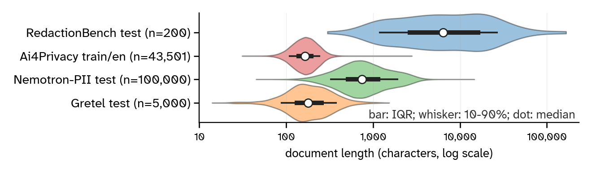

RedactionBench is an evaluation-only benchmark for character-level redaction across eleven document categories. Each of the 200 documents is manually-annotated with character spans that are either `mandatory` (must redact) or `contextual`.
RedactionBench mixes 101 real-world documents manually sourced from the public web (transcribed, augmented) with 99 synthetic documents authored to fill categories where synthetic data is more appropriate.


The above is not an excerpt from the dataset, but demonstrates the fine-grained labeling conventions used throughout the benchmark. Red spans are mandatory and yellow spans are contextual.
We detect certain contextual spans as being syntactic glue, dubbed "combinators", and highlight them in blue. While optional, grouping the spans into their constituent entities is useful for normalizing highly composite elements so they don't dominate the metric.

We created RedactionBench directly in response to [Ai4Privacy](https://huggingface.co/datasets/ai4privacy/pii-masking-200k), [GretelAI](https://huggingface.co/datasets/gretelai/gretel-pii-masking-en-v1), and [NVIDIA](https://huggingface.co/datasets/nvidia/Nemotron-PII), whose dataset-benchmarks have played a large role in open development of PII security models. Upon reviewing each of these datasets, we determined that they are unreliable as benchmarks for PII in general because of 1) inconsistent label quality 2) synthetic data which doesn't emulate real documents and 3) fixed taxonomy/lack of a robust privacy framework.



## Evaluation

The official RedactionBench metric is the **R-Score**. A reference implementation will be released shortly; this README will be updated with usage instructions and a pointer to the function once it is published.


### Leaderboard (34 models)

The full set of models we evaluated, sorted by mean R-Score:

| Rank | Model | Family | R-Score (mean) | 
|---:|---|---|---:|
| 1 | claude-opus-4-6 | Frontier LLMs | 0.714 | 
| 2 | gpt-5.4 | Frontier LLMs | 0.659 | 
| 3 | Qwen/Qwen3.5-397B-A17B | Frontier LLMs | 0.592 | 
| 4 | openai/privacy-filter | OpenAI Privacy Filter | 0.578 | 
| 5 | zai-org/GLM-5.1 | Frontier LLMs | 0.562 | 
| 6 | gretel_gliner_bi_large_v1_0 | GLiNER | 0.472 | 
| 7 | OpenMed/OpenMed-PII-SuperClinical-Large-434M-v1 | DeBERTa-v3 | 0.459 | 
| 8 | B2NER-InternLM2.5 | B2NER | 0.447 | 
| 9 | nvidia_gliner_pii | GLiNER | 0.421 | 
| 10 | B2NER-InternLM2.5-7B | B2NER | 0.402 | 
| 11 | jakobhuss/pii-extractor-gemma-3-270m-it | SLMs / Extractors | 0.401 | 
| 12 | hydroxai_pii_masker | DeBERTa-v3 | 0.382 | 
| 13 | eternisai/Anonymizer-4B | SLMs / Extractors | 0.362 | 
| 14 | E3-JSI/gliner-multi-pii-domains-v1 | GLiNER | 0.350 | 
| 15 | iiiorg/piiranha-v1-detect-personal-information | RoBERTa / Other | 0.343 | 
| 16 | distil-labs/Distil-PII-Llama-3.2-3B-Instruct | SLMs / Extractors | 0.337 | 
| 17 | urchade/gliner_multi_pii-v1 | GLiNER | 0.329 | 
| 18 | numind/NuExtract-2.0-2B | SLMs / Extractors | 0.317 | 
| 19 | Universal-NER/UniNER-7B-all | SLMs / Extractors | 0.316 | 
| 20 | numind/NuExtract-1.5-tiny | SLMs / Extractors | 0.308 | 
| 21 | knowledgator/gliner-pii-base-v1.0 | GLiNER | 0.304 | 
| 22 | numind/NuExtract-2.0-4B | SLMs / Extractors | 0.293 | 
| 23 | ai4privacy/llama-english-anonymiser-openpii | ModernBERT (BIO) | 0.270 | 
| 24 | h2oai/deberta_finetuned_pii † | DeBERTa-v3 | 0.250 | 
| 25 | lakshyakh93/deberta_finetuned_pii † | DeBERTa-v3 | 0.250 | 
| 26 | hivetrace/gliner-guard-uniencoder | GLiNER | 0.235 | 
| 27 | hivetrace/gliner-guard-biencoder | GLiNER | 0.221 | 
| 28 | Isotonic/distilbert_finetuned_ai4privacy_v2 | DistilBERT (BIO) | 0.216 | 
| 29 | ai4privacy/llama-multilingual-categorical-anonymiser-openpii | ModernBERT (BIO) | 0.213 | 
| 30 | urchade/gliner_multi-v2.1 | GLiNER | 0.209 | 
| 31 | tanaos/tanaos-text-anonymizer-v1 | RoBERTa / Other | 0.202 | 
| 32 | deepaksiloka/PII-Detection-V2.1 | DistilBERT (BIO) | 0.196 | 
| 33 | distil-labs/Distil-PII-Llama-3.2-1B-Instruct | SLMs / Extractors | 0.175 | 
| 34 | OpenPipe/PII-Redact-General | SLMs / Extractors | 0.113 | 
| 35 | distil-labs/Distil-PII-gemma-3-270m-it | SLMs / Extractors | 0.095 | 

† h2oai and lakshyakh93 are mirrored uploads of the same checkpoint and produce identical scores; we count them as a single model (34 unique).

Full evaluation methodology — task setup, prompt format, threshold-search procedure, taxonomy survey, and per-category breakdowns — will be documented alongside the reference implementation when it is released.

## Dataset Details

### Dataset Description

- **Curated by:** RedactionBench authors
- **Language(s) (NLP):** English (with embedded snippets of other languages)
- **License:** [CC BY 4.0](https://creativecommons.org/licenses/by/4.0/)
- **Splits:** `test` only (200 rows)
- **Schema:** `raw_text`, `spans`, `category`, `genre`, `is_synthetic`, `original_document_url`

### Genre Breakdown

Synthetic genres are *italicized*; non-italic entries are real-world documents sourced from the public web.

#### Unstructured categories

| Category | Genres |
|---|---|
| Academic | academic_probation_appeal, course_syllabus, diploma, disciplinary_record, enrollment, fafsa, financial_aid_award_letter, grade_appeal, graded_assignment, recommendation_letter, report_card, research_agreement, student_grievance, title_ix, transcript, transcript_request |
| Emails | *bank_alert*, *hr_onboarding*, *internal_creds*, *job_application*, *legal_thread*, *medical_referral*, *meeting_invite*, *newsletter_announce*, *order_receipt*, *password_reset*, *personal_social*, *phishing_lure*, *robotarium_newsletter*, *server_alert*, *shipping_confirm*, *travel_itinerary* |
| Financial | 1040, account_application, acord_claim_form, bank_statement, bitcoin_wallet_export, card_statement, chargeback_rebuttal_letter, deposit_slip, direct_deposit_authorization_form, flight, invoice, k1, receipt, remittance_advice, signature_card, sim_registration, w9, wire_transfer_request |
| Government | birth_certificate, building_permit, census_form, customs_declaration, drivers_license, form_i_589, jury_summons, police_report, public_records_request, social_security, tax_lien, vaccination, vehicle_title_registration, visa, voter_registration_card, workers_compensation_claim |
| Legal | bail_bond, bylaws, cease_desist, certificate_of_incorporation, declarations, ds_160, ds_2019, employment, i765_ead, i9, lease_agreement, marital_settlement, offer_letter, pip, prenuptial, promissory_note, qdro, sofa |
| Medical | behavioral_health_safety_plan, break_the_glass, cms_1500, confinement_form, consultation_note, discharge_summary, ecg_tracing, explanation_of_benefits, mds_3, operative_report, prescription, prior_authorization_request_form, psychotherapy_notes, radiology_report, sterilization_consent, triage_note |
| Operations | benefits_enrollment, bill_of_lading, boarding_pass, hotel_reservation, interview_schedule, offer_letter, onboarding_packet, pay_stub, proof_of_delivery, property_tax, resignation_letter, session_transcript, shipping_label, transfer_notice, uber_receipt |

#### Structured categories

| Category | Genres |
|---|---|
| Code | *bashrc*, *c_program*, *css_file*, *dockerfile*, *github_actions_ci*, *go_service*, *html_page*, *java_properties*, *javascript_config*, *makefile*, *php_config*, *python_db_script*, *ruby_config*, *rust_main*, *sql_seed*, *terraform_main* |
| Files | *browser_storage*, *crypto_wallet_export*, *csv_api_keys_export*, *csv_financial*, *csv_identity_export*, *csv_server_inventory*, *dotenv*, *exchange_api_config*, *gpg_export*, *hl7_adt_message*, *htpasswd*, *ics_calendar*, *json_api_response*, *json_aws_config*, *json_package_lock*, *jwt_tokens*, *ldap_dump*, loan_agreement, *mrz_passport_batch*, *ndjson_app_errors*, *ndjson_audit_log*, *ndjson_cloudtrail*, *password_manager_csv*, *recovery_keys*, *ssh_config*, *terraform_tfvars*, *toml_config*, *toml_pyproject*, vcf, *xml_incident_report*, *xml_junit_results*, *xml_maven_pom*, *xml_rss_feed*, *yaml_ansible_playbook*, *yaml_docker_compose*, *yaml_k8s_secret* |
| Logs | *apache_combined_log*, *app_structured_json*, *auth_syslog*, *blockchain_node_log*, *ci_runner_log*, *cloudtrail_json*, *docker_daemon_log*, *firewall_log*, *gcp_audit_log*, *kubernetes_events*, *mysql_slow_query*, *nginx_access_log*, *postgresql_audit_log*, *redis_log*, *smtp_log*, *vpn_log*, *windows_event_log* |
| Terminal | *ansible_deploy_session*, *aws_cli_session*, *ci_cd_runner_session*, *core_dump_session*, *database_admin_session*, *docker_compose_session*, *env_leak_session*, *git_history_session*, *incident_response_session*, *kubernetes_session*, *nvtop_monitoring_session*, *package_install_session*, *python_traceback_session*, *reverse_shell_forensics*, *ssh_tunneling_session*, *sysadmin_recon_session* |

### Dataset Sources

- **`original_document_url` (column):**  contains the source url for each real-world document
- **Croissant metadata (with RAI fields):** [croissant.json](https://huggingface.co/datasets/RedactionBench/RedactionBench/resolve/main/croissant.json)

## Uses

### Direct Use

RedactionBench measures whether a model or system can identify and bound the character spans in a document that must be redacted (`mandatory`) versus those that may be redacted without penalty (`contextual`). Concrete validated uses:

- End-to-end evaluation of redaction systems on heterogeneous English documents.
- Cross-model comparison under a fixed metric, including LLM extractors, discriminative NER models, and rule-based baselines.
- Threshold sweeps and per-category error analysis (a manual look at where a model fails is encouraged — the categories are intentionally diverse).

Performance on RedactionBench should be read as a **lower bound** on real-world redaction quality. The benchmark fixes a single labeling of each document, but does not verify whether `contextual` decisions form a coherent privacy policy. Downstream users are expected to extend the benchmark with custom prompts or context bindings to capture Contextual-Integrity-style policies their application requires.

### Out-of-Scope Use

RedactionBench is **not** suitable for:

- Training or fine-tuning production redaction systems (it is `test`-only and intentionally tiny).
- Certifying compliance with HIPAA, GDPR, CCPA, or any regulatory regime.
- Multilingual redaction or non-English deployment.
- Auditing clinical or legal redaction systems for deployment readiness.
- Any setting where benchmark performance would be taken as evidence of safety in safety-critical applications.

## Dataset Structure

The dataset has a single `test` split with 200 rows and the following six fields:

| Field | Type | Description |
|---|---|---|
| `raw_text` | `string` | Document text with redaction markers stripped. |
| `spans` | `list<{start: int, end: int, label: string}>` | Character spans. `label` is one of `mandatory` (must-redact) or `contextual` (may-redact-without-penalty). |
| `category` | `string` | One of `academic`, `code`, `emails`, `files`, `financial`, `government`, `legal`, `logs`, `medical`, `operations`, `terminal`. |
| `genre` | `string` | Document-genre folder name within the category. Underscore-prefixed genres are synthetic. |
| `is_synthetic` | `bool` | True iff the row's genre folder begins with `_`. |
| `original_document_url` | `string \| null` | Source URL for non-synthetic rows; `null` for synthetic rows. |

Span character offsets are half-open intervals `[start, end)` over `raw_text`.

### Per-category counts

| Category | Rows |
|---|---|
| files | 36 |
| financial | 18 |
| legal | 18 |
| logs | 17 |
| academic | 16 |
| code | 16 |
| emails | 16 |
| government | 16 |
| medical | 16 |
| terminal | 16 |
| operations | 15 |
| **Total** | **200** |

`is_synthetic` is balanced (101 real / 99 synthetic).

## Dataset Creation

### Curation Rationale

The benchmark targets the gap between toy PII test sets (single-domain, single-format) and the heterogeneous documents real-world redaction systems must handle. Eleven categories were selected to span both *unstructured* documents (academic, emails, financial, legal, medical, government, operations) and *structured* / serialized formats (code, files, logs, terminal). Within each category, genres were chosen to reflect realistic information-worker artifacts.

### Source Data

#### Data Collection and Processing

1. **Genre compilation.** Approximately a thousand candidate genres were proposed by an ensemble of frontier language models (GPT-5.1, Claude Opus 4.5, Gemini 3.1 Pro), then manually deduplicated and refined down to the final genre list.
2. **Real-document sourcing.** For each genre in the unstructured categories, a real-world representative document was sourced via manual web search with location personalization disabled and rotated state/region queries to avoid clustering on a single jurisdiction.
3. **Synthetic-document authoring.** Structured-category documents (code, files, logs, terminal) and a small number of unstructured-category fillers were authored from scratch by the project team with frontier-LLM assistance. Synthetic rows are marked with a leading underscore in their genre folder name.
4. **LLM augmentation.** All documents were augmented by a mix of frontier LLMs to enrich realism (boilerplate, formatting normalization) without changing high-level intent. Augmentation prompts were applied per document and reviewed before acceptance.
5. **Entity randomization.** Several passes of entity randomization (deterministic and LLM-assisted) replaced names, addresses, identifiers, and other PII-shaped tokens with type-consistent fabricated values to ensure no real-individual identifier survives.

#### Who are the source data producers?

Source documents are publicly available forms, templates, and examples published by U.S. federal agencies (IRS, USCIS, CBP, SEC, etc.), U.S. state and local governments, educational institutions, and a small number of commercial template sites. See [croissant.json](https://huggingface.co/datasets/RedactionBench/RedactionBench/resolve/main/croissant.json) `prov:wasDerivedFrom` for the full per-document attribution. We supply conservative licensing heuristics based on each domain, since original licenses are uncertain.

### Annotations

#### Annotation process

All 200 documents were span-annotated by a single lead annotator using a two-tier rubric:

- **Mandatory** spans: identifiers, credentials, names, addresses, account numbers, MRNs, dates of birth, and similar values that should be redacted in any reasonable privacy posture.
- **Contextual** spans: information that may or may not warrant redaction depending on the downstream policy (organization names, job titles, partial identifiers, network metadata) and additional context not present in the document itself. As such, contextual spans should not be treated as "optional", and instead are included to accomodate the space of possible successful redactions in different circumstances (privacy lower bound).

### Personal and Sensitive Information

**No real PII is present.** All real-document rows are sourced from publicly available forms and templates whose embedded names/identifiers are placeholders, public officials acting in their official capacity, or values already published by the source. Synthetic rows contain entirely fabricated identifiers. All entities were randomized in post-processing as a defense in depth; any apparent reference to a real individual should be treated as coincidence and reported to the maintainers. No new PII was collected from human subjects, no IRB review was required, and no crowdsourced personal disclosures are included.

## Bias, Risks, and Limitations

The real-document subset over-represents U.S. government forms, medical forms, and English-language institutional templates, and under-represents private correspondence, non-Western document formats, and non-English content. Augmentation by frontier LLMs introduces the inherited biases of those generators; multi-pass randomization mitigates but does not eliminate low-entropy patterns invisible to the human eye, and some randomized values can fall slightly outside real-world parameter ranges. Genre coverage within categories is mostly even; the `files` category is intentionally over-represented (36 rows) because structured-file formats fragment into many distinct serializations. A crucial gap in the distribution is largely public or wiki-like content that is full of entities but where none need to be redacted — all RedactionBench documents are private or semi-private, so the benchmark may understate the false-positive rate on benign data.

### Recommendations

- Treat scores on RedactionBench as a **minimum** quality bar, not a sufficient one.
- Pair benchmark evaluation with manual error inspection per category to understand failure modes.
- Do not deploy a system to clinical, legal, or financial production redaction on the basis of RedactionBench performance alone.
- For multilingual or non-Western deployment, supplement with locale-specific evaluation.

## Citation

Citation metadata will be finalized at release time. For now, please cite via the dataset URL:

```
@misc{redactionbench2026,
  title  = {RedactionBench},
  year   = {2026},
  url    = {https://huggingface.co/datasets/RedactionBench/RedactionBench}
}
```

## More Information

- **Croissant 1.1 metadata (including RAI fields):** [croissant.json](https://huggingface.co/datasets/RedactionBench/RedactionBench/resolve/main/croissant.json)
- **Schema:** see Dataset Structure above
- **License:** [CC BY 4.0](https://creativecommons.org/licenses/by/4.0/)

---

This page is adapted from the [RedactionBench dataset card](https://huggingface.co/datasets/RedactionBench/RedactionBench), released under [CC BY 4.0](https://creativecommons.org/licenses/by/4.0/).
