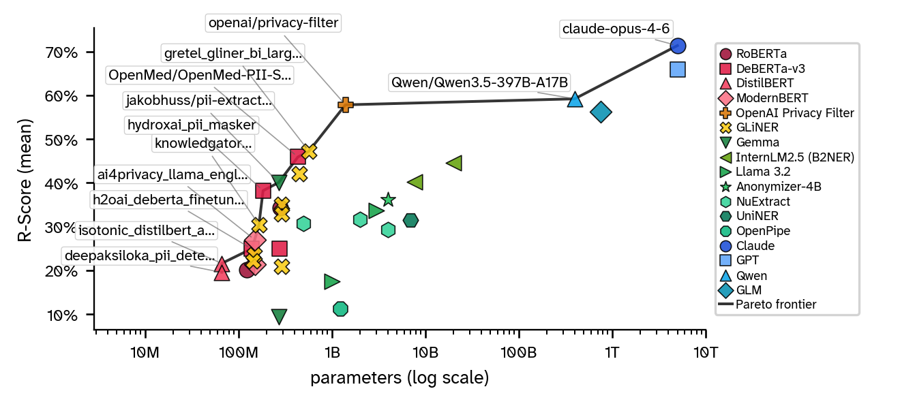

## Evaluations

<figure class="paper-figure">
    

        
    

    <figcaption>Mean R-Score over Model Size</figcaption>
</figure>

### Overall Model Leaderboard

| Rank | Model | Family | R-Score mean |
|---:|---|---|---:|
| 1 | `claude-opus-4-6` | Frontier LLMs | 0.714 |
| 2 | `gpt-5.4` | Frontier LLMs | 0.659 |
| 3 | `Qwen/Qwen3.5-397B-A17B` | Frontier LLMs | 0.592 |
| 4 | `openai/privacy-filter` | OpenAI Privacy Filter | 0.578 |
| 5 | `zai-org/GLM-5.1` | Frontier LLMs | 0.562 |
| 6 | `gretel_gliner_bi_large_v1_0` | GLiNER | 0.472 |
| 7 | `OpenMed/OpenMed-PII-SuperClinical-Large-434M-v1` | DeBERTa-v3 | 0.459 |
| 8 | `B2NER-InternLM2.5` | B2NER | 0.447 |
| 9 | `nvidia_gliner_pii` | GLiNER | 0.421 |
| 10 | `B2NER-InternLM2.5-7B` | B2NER | 0.402 |
| 11 | `jakobhuss/pii-extractor-gemma-3-270m-it` | SLMs / Extractors | 0.401 |
| 12 | `hydroxai_pii_masker` | DeBERTa-v3 | 0.382 |
| 13 | `eternisai/Anonymizer-4B` | SLMs / Extractors | 0.362 |
| 14 | `E3-JSI/gliner-multi-pii-domains-v1` | GLiNER | 0.350 |
| 15 | `iiiorg/piiranha-v1-detect-personal-information` | RoBERTa / Other | 0.343 |
| 16 | `distil-labs/Distil-PII-Llama-3.2-3B-Instruct` | SLMs / Extractors | 0.337 |
| 17 | `urchade/gliner_multi_pii-v1` | GLiNER | 0.329 |
| 18 | `numind/NuExtract-2.0-2B` | SLMs / Extractors | 0.317 |
| 19 | `Universal-NER/UniNER-7B-all` | SLMs / Extractors | 0.316 |
| 20 | `numind/NuExtract-1.5-tiny` | SLMs / Extractors | 0.308 |
| 21 | `knowledgator/gliner-pii-base-v1.0` | GLiNER | 0.304 |
| 22 | `numind/NuExtract-2.0-4B` | SLMs / Extractors | 0.293 |
| 23 | `ai4privacy/llama-english-anonymiser-openpii` | ModernBERT (BIO) | 0.270 |
| 24 | `h2oai/deberta_finetuned_pii` † | DeBERTa-v3 | 0.250 |
| 25 | `lakshyakh93/deberta_finetuned_pii` † | DeBERTa-v3 | 0.250 |
| 26 | `hivetrace/gliner-guard-uniencoder` | GLiNER | 0.235 |
| 27 | `hivetrace/gliner-guard-biencoder` | GLiNER | 0.221 |
| 28 | `Isotonic/distilbert_finetuned_ai4privacy_v2` | DistilBERT (BIO) | 0.216 |
| 29 | `ai4privacy/llama-multilingual-categorical-anonymiser-openpii` | ModernBERT (BIO) | 0.213 |
| 30 | `urchade/gliner_multi-v2.1` | GLiNER | 0.209 |
| 31 | `tanaos/tanaos-text-anonymizer-v1` | RoBERTa / Other | 0.202 |
| 32 | `deepaksiloka/PII-Detection-V2.1` | DistilBERT (BIO) | 0.196 |
| 33 | `distil-labs/Distil-PII-Llama-3.2-1B-Instruct` | SLMs / Extractors | 0.175 |
| 34 | `OpenPipe/PII-Redact-General` | SLMs / Extractors | 0.113 |
| 35 | `distil-labs/Distil-PII-gemma-3-270m-it` | SLMs / Extractors | 0.095 |

† `h2oai/deberta_finetuned_pii` and `lakshyakh93/deberta_finetuned_pii` are mirrored uploads of the same checkpoint and produce identical scores.
