

<head>
    
    <!--
    
    -->
</head>

  <!-- GRIG Project -->
  

    

        
        
    

    

      <h2>Auto-Riggable Gaussian Characters (WIP)</h2>
      
<b>Credits: </b>Sean Brynjólfsson, Evan Zhang, Justin Tien-Smith

      
<b>Description:</b>
      Recently, techniques for solving gaussian splats of dynamic scenes 
      (<a href="https://github.com/JonathonLuiten/Dynamic3DGaussians"><i>Dynamic3DGaussians</i></a>, 2024) 
      have found success in using local rigidity constraints to enforce spatial and temporal consistency. 
        
      We use this detailed representation and decompose it into the rigid parts and joints which describe their 
      movement. This procedure makes no assumptions about the anatomy of the dynamic entities within the scene and 
      therefore should work equally well for all people, animals, machines---anything that moves about a discrete set
      of joints. We're currently implementing the joint solver after getting promising results for our clustering 
      algorithm to find the bones.
        
      Our final deliverable will be an animation-ready gaussian rig and a portable format for them. Clustering also 
      massively downsizes the storage requirements because local rigidity means gaussians are predictive of their
      neighbors---no need to track all of them. We are also developing more visualizations to help understand 
      the limitations of the representation present. In doing so we have spotted some new failure modes of the 
      original method, like how some regions gradual creep into neighboring regions over time.
      

      <h3><a href="https://github.com/jolfss/grig"><b>GitHub Repo</b></a>
      </h3>
    

  

  <!-- Let it SIMmer Project, VoxSeg, OVT -->
  

    

      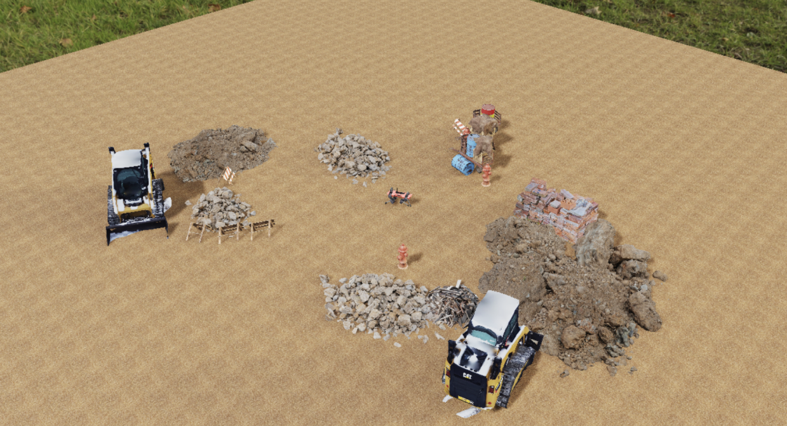
      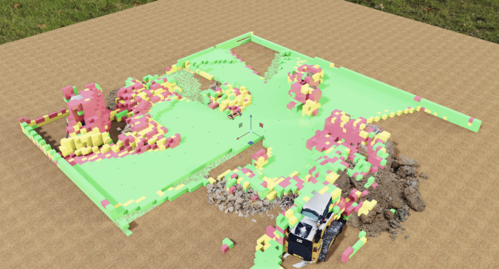
      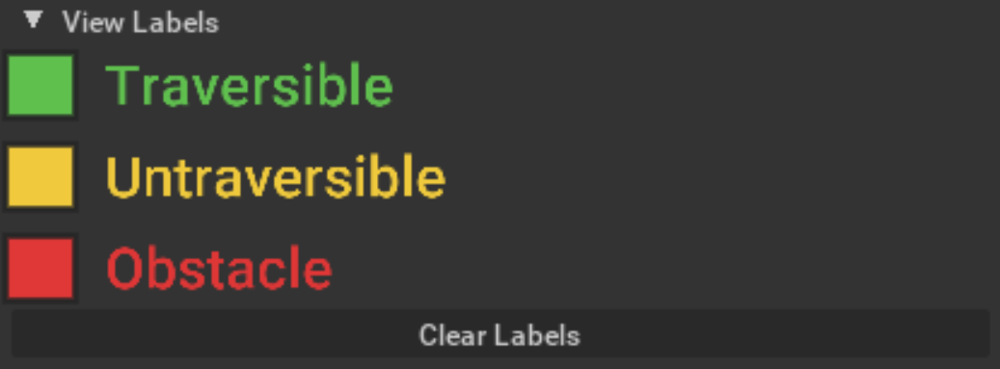
      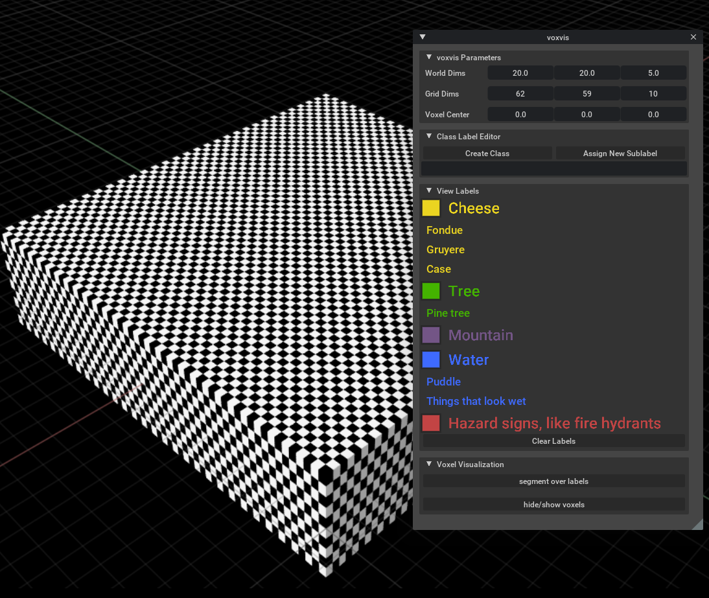
      <!--
      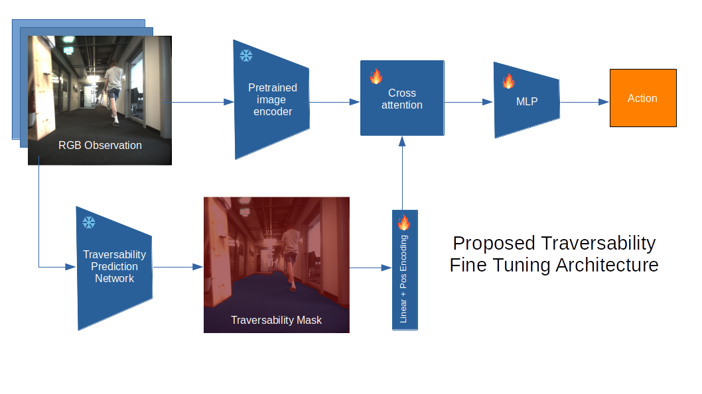
      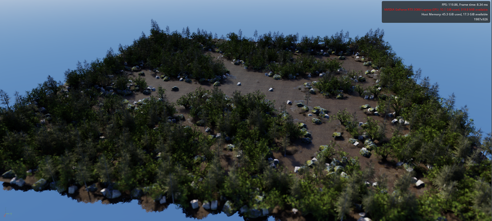
      -->
    

    

      <h2>Let it SIMmer / Open-Vocabulary Traversability</h2>
      
<b>Credits:</b> Sean Brynjólfsson, Will Huey

      
<b>Description:</b>
      Generalizing to new and dynamic environments is a significant challenge in mobile robotics. Nowadays, 
      vision-aware models are more prevalent and significantly powerful. These models are capable of producing robust,
      semantic features that make downstream tasks like navigation significantly easier. Images are rich enough to 
      characterize many cues that geometric information alone does not provide.
      <!-- ---ice is slippery, puddles aren't 
      bottomless voids, that concrete is wet (an orange prop-up nearby reads 'wet concrete', even though it looks dry).
      -->
        
      Three implementations comprise our overall method. In total, our system allows for streaming from a robot to a 
      compute node which then answers classification requests from users in either Isaac Sim or Rviz.
      <ol>
        <li><b>Voxvis:</b> An extension for NVIDIA Omniverse's Isaac Sim to interface with the voxel segmentations; 
        we also provide a similar accompanying Rviz visualization. Communication between the modules is implemented in
        ROS, making it suitable for both live, simulated, and replay data.
        </li><li>
        <b>OVT:</b> An open-vocabulary traversability segmentation framework. This is a ros node that processes 
        incoming RGB-D images and extracts embeddings for each pixel and then bundles it with odometry and pose data 
        from the robot. (We don't collapse the embeddings into a classification yet, we let it <i>SIMmer</i>)
        </li><li>
        <b>Voxseg:</b> A bridge between OVT and Voxvis, Voxseg simultaneously updates the internal voxelized embeddings
         and handles requests from Voxvis for a particular user-specified, open-vocabulary classification over them. 
        </li>
      </ol>
      We also implemented other helpful tools to generate environments in Omniverse, such as construction sites and 
      forested scenes, (<a href="https://github.com/jolfss/isaac_stage/tree/main/isaac_stage">Isaac Stage GitHub</a>).
      <i>NOTE: This has <b>not</b> been updated to the latest major version of Isaac Sim/Orbit.</i>
      

      <h3><a href="https://github.com/willh003/ovt"><b>GitHub Repo</b></a> 
      | <a href="files/LetItSIMmer.pdf"><b>Project Paper</b></a></h3>
    

  

  <!-- Visual Navigation Project -->
  

    

      <!---->
      
      
      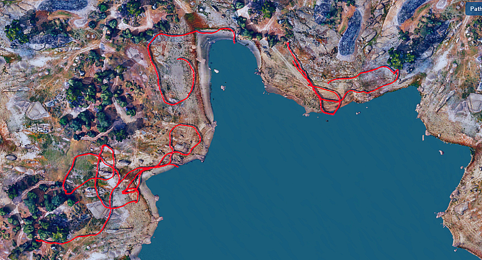
    

    

      <h2>Visual Navigation with Traversability Priors</h2>
      
<b>Credits:</b> Sean Brynjólfsson, Will Huey

      
<b>Description:</b> 
      Continuing our work with open-vocabulary traversability, we were interested in training smaller models on
      specific traversability scenarios. Our original model was too large to fit on the ANYmal's NVIDIA Jetson 
      processor and its inference speed was quite slow (~7s). Since we did not experiment with prompts that changed 
      during rollout, we were wasting a lot of compute by preserving its open-vocabulary capabilities. Thus we chose 
      to train a smaller model on the bigger model with a fixed prompt. For example, "you are a robot who cannot 
      climb stairs". Model distillation is not so interesting on its own, but being able to do so over an abstract 
      description of traversability is quite useful.
        
      In this paper, we demonstrate that weak traversability priors can be obtained from large open vocabulary image 
      segmentation models and that they appear to be consistent across environments. We then apply model distillation 
      techniques to train a smaller traversability prediction network capable of real time inference, and demonstrate 
      a heuristic that uses this distilled network to perform obstacle avoidance when roaming freely.
      <!--
               
      Based on how the CLIP embedding space is trained, we did not expect traversability to have much signal in the
      abstract. Traversability is not so much about what's in the scene but how it is configured, the agent in 
      question, and rules about the environment---cars should not drive on public green spaces. To our surprise, 
      labels akin to "traversable" and "untraversable" seemed to have a good representation that was consistent with 
      what the average human might say for a human agent. We <i>briefly</i> investigated parametrized scenarios but 
      had little success deviating from this "average human traversability" with naïve prompting. This is something we 
      would like to explore further.
      -->
      

      <h3><a href="files/VisualNavTravPriors.pdf"><b>Project Paper</b></a></h3>
    

  

  <!-- Compositional Splatting Project -->
  

    

      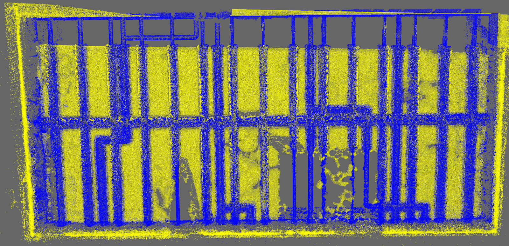
      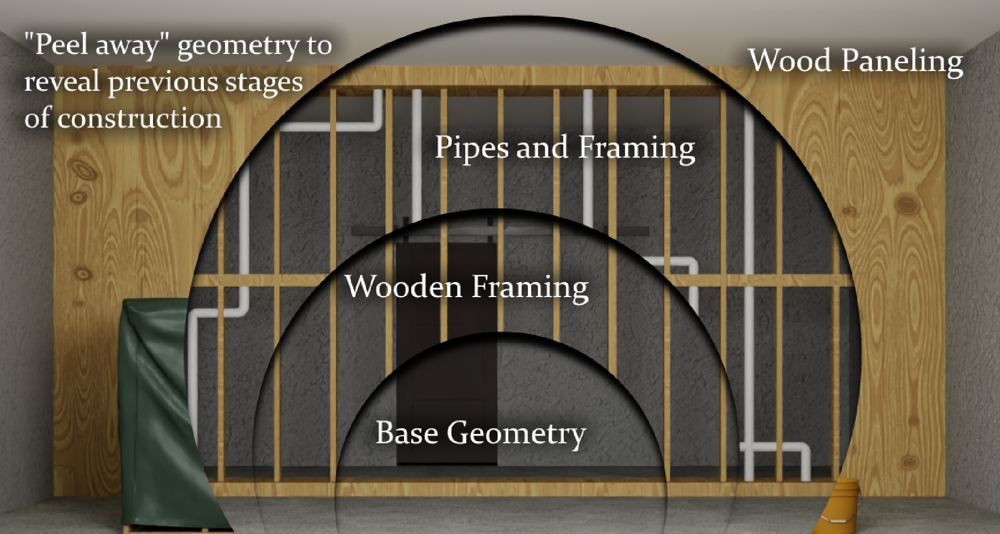
    

    

      <h2>Compositional Splatting for Construction Sites</h2>
      
<b>Credits:</b> Sean Brynjólfsson, Evan Zhang, Natalie Leung, Danish Qureshi, Dyllan Hofflich

      
<b>Description:</b> 
      We investigate the potential applications of gaussian splatting on construction sites to capture a holsitic
      digital twin throughout the construction process via legged robots. This project was our collective introduction
      to gaussian splatting, so a large portion of it is dedicated to a review of currently existing methods.         
      We used NVIDIA Omniverse to model our simulated environment and an ANYmal-D equipped with a RGBD camera.
      One part of our team worked with the Blender-to-Omniverse connector to try and get realistic construction 
      environs for us to simulate. Another subteam worked on image segmentation, settling on Kimera to track and 
      segment out dynamic objects so they wouldn't confuse the gaussian splatter (which requires static scenes). 
      My part of the project was compositing different versions of the same scene together. After considering several
      implementations, we settled on SplaTAM because we figured we could modify its "silhouette masking" feature with
      our own segmentations in order to adapt it to dynamic scenes and remove clutter which we did not want
      incorporated into the final model.
        
      I learned a great amount through the failures and compromises I had to make my end of the project. By the end, we
      had dissected SplaTAM so completely that the -TAM (Tracking-and-Mapping) was unused---it may as well have been
      any generic gaussian splatter. If I were to do this again, I would leave the splatting as a post-run task.
      

      <h3><a href="files/SplatConstruction.pdf"><b>Project Paper</b></a></h3>
    

  

  <!-- Fractal Raytracer -->
  

    

      
      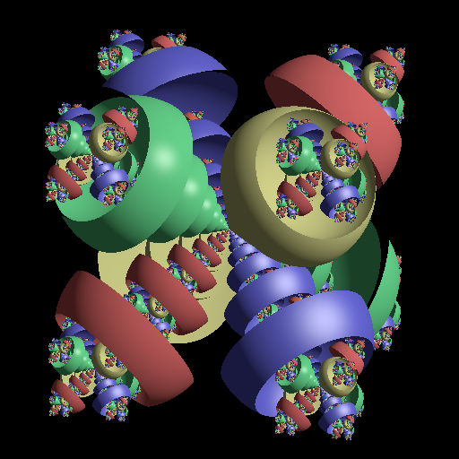
    

    

      <h2>Fractal Raytracer</h2>
      
<b>Credits:</b> Sean Brynjólfsson, Jack Otto

      
<b>Description:</b>
      This fractal raytracer was a creative assignment for Cornell's CS4620 graphics course. The premise was simply to
      take the raytracer we had just completed in a prior assignment and augment it with some new feature. We chose to
      try generating some constructive solid geometry fractals. The idea is quite simple; our scene is composed of two
      types of objects: spheres and reentrant spheres. Rays which hit spheres bounce as they would ordinarily for solid
      geometry, rays which hit a reentrant sphere descend recursively into copies of the scene. We also treat the
      reentrant spheres as subtractive of the solid spheres they intersect, so rays that leave a subscene won't end up
      inside solid geometry. If a ray passes through the subscene and doesn't hit either a solid or reentrant 
      primitive, it decrements its recursive depth until it has popped off all the layers it has descended.
        
      We were halfway through implementing the algorithm in CUDA, so maybe one day we'll finish that up. :-)
      

    

  

  <!-- LLMímir Project -->
  

    

      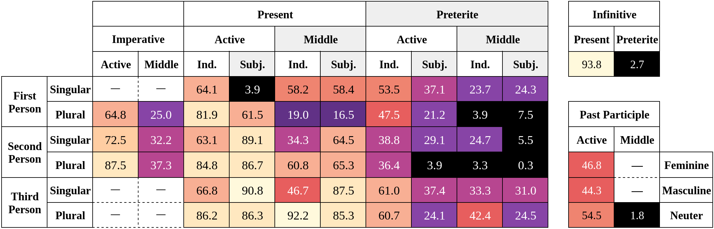
      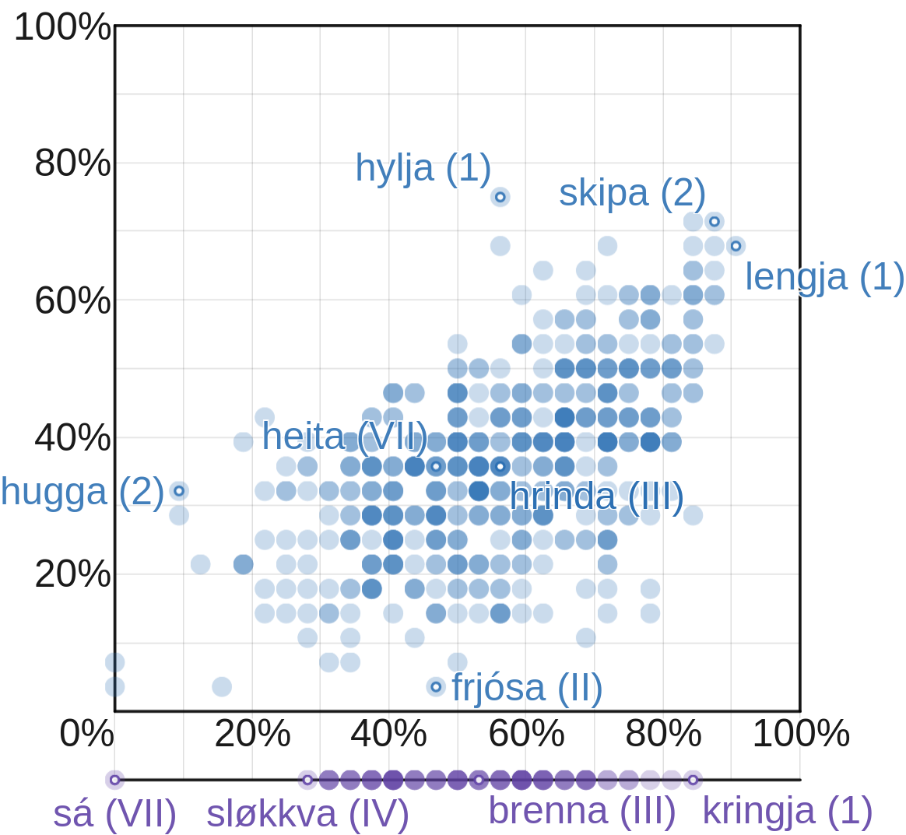
    

    

      <h2>LLMímir: Evaluating GPT-4 on Old Norse Verbs</h2>
      
<b>Credits:</b> Sean Brynjólfsson

      
<b>Description:</b>
      Most people aren't aware that <i>Icelandic</i> is GPT-4's second language; but it is. 
        
      Old Norse (often called Old Icelandic) is a language which is incredibly similar to modern Icelandic. 
      For that reason, I was interested in investigating how trustworthy it might be for questions on Old Norse 
      grammar and potentially for creative and academic/self-study uses. <i>Would GPT-4 benefit from more exposure 
      to Icelandic or would that bleed into its understanding of Old Norse?</i>
      <!--
        
      Since this was a minor project, I limited the scope to something I would have the resources to evaluate: 
      <i>conjugation accuracy</i>. Though conjugation accuracy is only a weak metric for its capabilities in general, 
      having some idea how well it understands grammatical terminology can set some reasonable expectations for its 
      use as a quick reference. 
      -->
        
      This paper examines GPT-4 on <b>all</b> Old Norse verbs and their verb forms. The experiment was conducted at a 
      temperature of 0 (since I could not afford to sample multiple responses per form) and with a blank context.
      This scenario should be nearly deterministic and yield low variance responses.
      

      <h3><a href="files/LLMímir.pdf"><b>Project Paper</b></a></h3>
    

  

  <!-- QCLL Project -->
  

    

      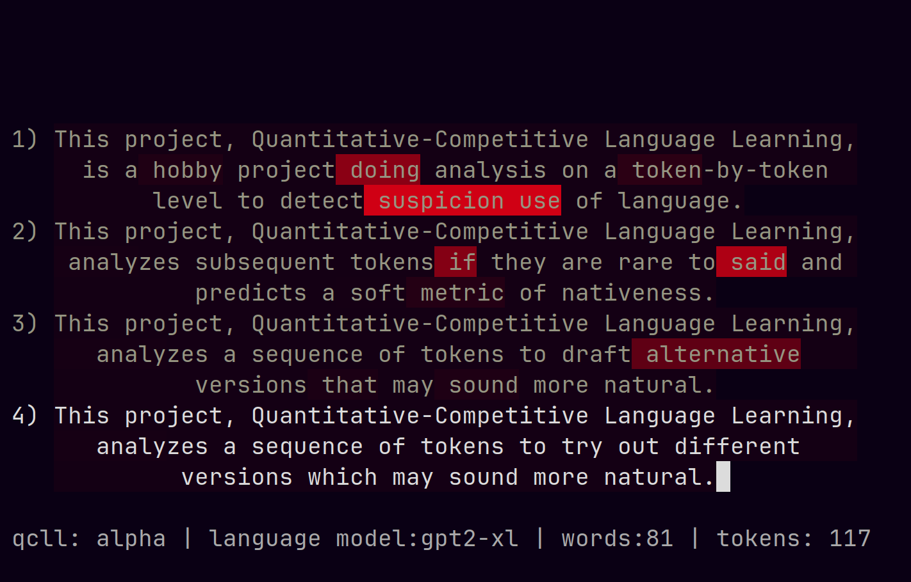
    

    

      <h2>Quantitative-Competitive Language Learning</h2>
      
<b>Credits:</b> Sean Brynjólfsson

      
<b>Description:</b> 
      This is a toy project aiming to use a LLM as a model-of-language. That might seem redundant, but what I mean
      by that is I care about the actual <i>distribution</i> over tokens, not the sampling/generative procedure that
      LLMs are typically synonymous with. Given a distribution of tokens, I compute an approximate branching factor 
      using the perplexity of the distribution and compare it with the user-supplied token probability; this gives a
      soft estimate for whether or not the model regards the next token as one of the possible continuations of the
      context preceding it. For example, if the branching factor is 40 but the token's probability is much less than 
      1/40 there's probably something weird going on. 
        
      The implementation makes use of the HuggingFace API and cached previous states to take advantage of the fact 
      hat people generally push and pop from the end of their text when they write. This makes append/delete 
      constant-time, which can be crucial for interactivity. I also implemented a handy Tokenstring class which keeps
      the token representation up to date with the string as it gets mutated, should be mostly model agnostic.
        
      What's so competitive about this? Well, my vision is to be able to place users on a distribution that spans from
      noise to language-learners to natives to the model itself. The key is to derive a stable metric which 
      corresponds to "yeah, this sentence is plausibly written by a native"; something I think <i>is</i> possible if
      enough care is taken to normalize over the relative probability of equally-viable but not equally-likely tokens.
      With that, users could get empirical feedback and track their progress as they learn a foreign language and even 
      compete with each other to produce the most or highest quality text.
      

      <h3><a href="https://github.com/jolfss/qcll"><b>GitHub Repo</b></a></h3>
    

  

