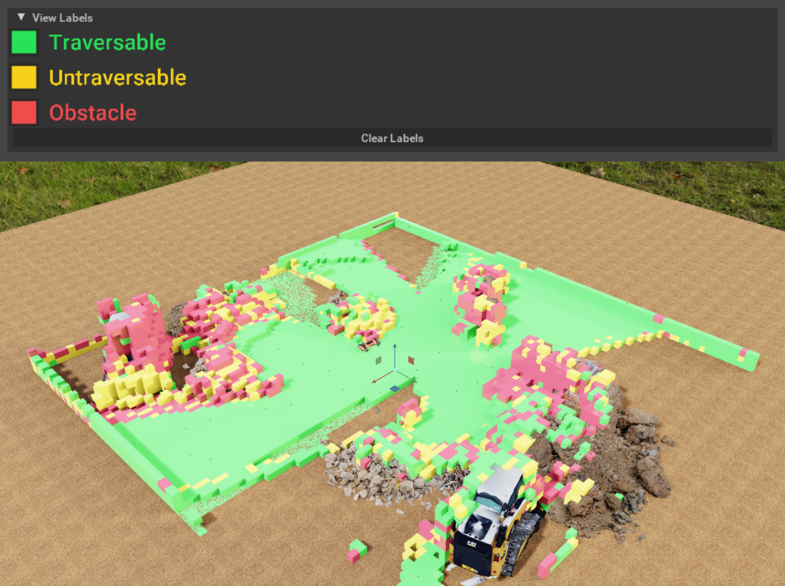

  <!-- GRIG Project -->
  

    

        
        
    

    

      <h2>Auto-Riggable Gaussian Characters</h2>
      
<strong>Credits:</strong> Sean Brynjólfsson, Evan Zhang, Justin Tien

      
<strong>Description:</strong> <i>(Current project)</i> Recent work has shown optimizing gaussian splats to satisfy local rigidity constraints can provide consistent tracking and orientation of regions of space throughout time. Given this, we aim to take such a representation of any actor in motion and decompose it into the rigid regions and eventually predict a joint structure. This would allow for easy production and animation of gaussian splat character models.

      <a href="https://github.com/jolfss/grig">GitHub Repo</a>
    

  

  <!-- Visual Navigation Project -->
  

    

      
      
    

    

      <h2>Visual Navigation with Traversability Priors</h2>
      
<strong>Credits:</strong> Sean Brynjólfsson, Will Huey

      
<strong>Description:</strong> Building on our previous work in Switzerland, my partner and I demonstrated a novel vision-only approach to navigation by distilling a light model capable of running real-time (93x speedup) on an the robot's jetson processor. We showed our method could generalize by rolling it out in a few environments distinct from its training set.

      <a href="files/VisualNavTravPriors.pdf">View or Download PDF</a>
    

  

  <!-- Let it SIMmer Project -->
  

    

      
    

    

      <h2>Let it SIMmer</h2>
      
<strong>Credits:</strong> Sean Brynjólfsson, Will Huey

      
<strong>Description:</strong> While at the ETH, my lab partner and I conducted research on legged robots, namely the ANYbotics ANYmal D. We developed a novel semantic image segmentation model which is able to distinguish between traversable and untraversable terrain zero-shot and deployed it on the live robot. Simultaneously, we made an extension for Nvidia Omniverse which voxelizes the environment as the robot walks around while a GUI interface can synchronously spatially segment it based on a user’s open vocabulary input.

      <a href="files/LetItSIMmer.pdf">View or Download PDF</a>
    

  

  <!-- QCLL Project -->
  

    

      
    

    

      <h2>Quantitative-Competitive Language Learning</h2>
      
<strong>Credits:</strong> Sean Brynjólfsson

      
<strong>Description:</strong> A hobby project attempting to use LLMs as a model of language to score humans on their ability to write natural-sounding text. Evaluation is designed in an efficient way to reuse prior embeddings as users edit their text since predictions are made causally and generally people push and pop from the end of their current phrase. Multi-token characters are not supported yet. Works decently for relative comparison of completions but no globally stable metric has been derived yet. There is no look-back so frequent tokens (like individual letters, components of longer words) are not punished when out of context; failure modes are also often very predictable (e.g. repeating words does not get punished).

      <a href="https://github.com/jolfss/qcll">GitHub Repo</a>
    

  

  <!-- Compositional Splatting Project -->
  

    

      
    

    

      <h2>Compositional Splatting for Construction Sites</h2>
      
<strong>Credits:</strong> Sean Brynjólfsson, Evan Zhang, Natalie Leung, Danish Qureshi, Dyllan Hofflich

      
<strong>Description:</strong> We demonstrate that gaussian splats are easy to compose and current optimizers can robustly preserve existing (hidden) geometry when new geometry is naively added on top. This is a scenario common in construction sites where components such as ducts are exposed before insulation and drywall are installed. This allows incremental updates instead of the constant overhead incurred by routine scans of an entire site. In the end, we envision a complete digital twin with the entire development history condensed into a complete, look-inside model.

      <a href="files/SplatConstruction.pdf">View or Download PDF</a>
    

  

  <!-- LLMímir Project -->
  

    

      
      
    

    

      <h2>LLMímir: Evaluating GPT-4 on Old Norse Verbs</h2>
      
<strong>Credits:</strong> Sean Brynjólfsson

      
<strong>Description:</strong> I evaluated GPT-4 (at the time) on its zero-shot recall of particular conjugations of verbs in Old Norse out of context at low temperature. I investigated several failure modes of the model and also performance across categories of verbs. The theory would be that GPT-4 would be at least as good at using verbs in context as it would being forced to recite them given terms in English grammar, so this would in some sense establish a lower bound. Many verbs are not even attested in Old Norse literature and the vast majority of forms have extremely sparse attestations, so GPT-4's performance is quite impressive.

      <a href="files/LLMímir.pdf">View or Download PDF</a>  
    

  

